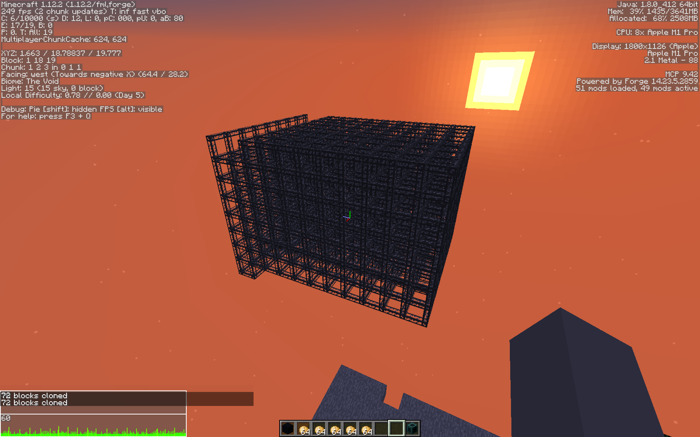
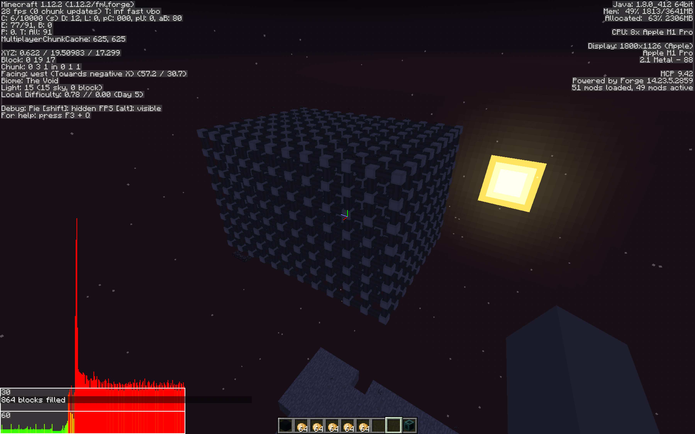

# Simple Storage Network (Brian's Fork)

A fork of [Lothrazar's fork](https://github.com/Lothrazar/Storage-Network) of [KidsDontPlay's Forge mod](https://github.com/KidsDontPlay/Storage-Network) for 1.12.2.

## Why The Fork?

Simply put, Simple Storage Network's cables cause the client's performance to go to shit.

Here's a comparison between performance looking at a cube of Applied Energistics 2's cables versus of Simple Storage Network's cables.

Spot the difference? (Specifically, FPS at the top left, and the big red frame times at the bottom left.)

The goal of this fork is to figure out *why* this is happening and then eliminate the cause.

No promises that I'll be able to reach that goal. I'll try my darndest, though.
